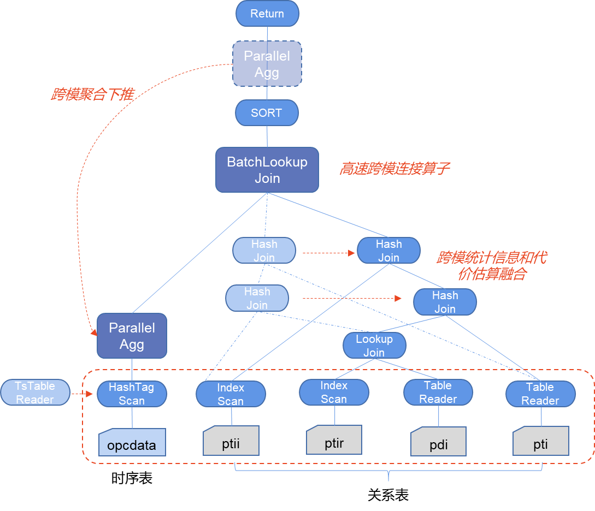

# 跨模查询
## 概述
跨模查询是KWDB的核心跨模能力的重要组成部分，主要指的是在KWDB中跨关系引擎和时序引擎的查询。  
在不少物联网业务场景下，用户通常会使用一张表（例如：时序表）存储所有的多模态数据（如：关系型+时序），导致表数据十分冗余庞大，查询速度慢等诸多问题。通过KWDB跨模技术的应用，能够打破传统数据存储与分析的边界，实现多模态数据的无缝连接与高效融合。在KWDB中，关系型数据与时序数据可分别存储于关系引擎与时序引擎，通过 KWDB 跨模查询，可实现大幅的性能提升。  
本项目旨在带领开发者快速体验KWDB的跨模查询。
## 技术特点
KWDB的跨模查询主要包含以下三项技术：  
1.跨模统计信息和代价估算融合技术：融合了多模的数据统计信息模型和代价估算策略，并以此为基础优化了跨模执行计划的规划和剪枝的逻辑，从而在遇到包括连接、聚合、排序、过滤、嵌套等非常复杂的业务查询的时候也能确保获得较优的执行计划  
2.跨模聚合下推技术：针对跨模计算中包含聚合计算的情况，本项目不仅实现了将常见且理论体系比较成熟的基于关系代数理论的聚合计算下推到时序引擎的优化技术，并且针对时序引擎中数据往往具有静态标签的特性，实现了时序引擎中聚合算子自适应降维和降维算子的自动调用  
3.高速跨模连接算子技术：针对传统数据库系统在跨引擎计算时处理跨模数据连接计算存在的性能问题，KWDB探索并实现了高速跨模连接算子的技术，此项技术通过在引擎融合、算子对接、内存管理、连接策略等方面一系列优化，实现了跨模连接计算效率提升几十倍甚至上百倍。  
下图示例展示的是时序数据跟关系数据的跨模查询计划，同时标识了我们应用的三种跨模查询的技术，首先基于跨模统计信息和代价估算融合技术来可以调整时序算子和关系算子的最优连接顺序，同时评估查询是否可以应用跨模聚合下推技术和高速跨模连接算子技术。图中BatchLookJoin就是KWDB 创新研发的高速跨模连接算子，可以进行高速连接计算，而跨模聚合下推会将聚合操作中关于时序部分的聚合操作推到前面提前聚合，大量裁剪传输的数据量。  

## 文件清单
```
multi-mode/
    ├── start_service.sh   # 启动数据库单机服务脚本
    ├── generate_data.sh   # 数据生成脚本，
    ├── create-load.sh     # 创建数据库，创建表以及导入数据的脚本 
    ├── create-load.sql    # 创建数据库，创建表以及导入数据的SQL命令
    ├── query.sh           # 跨模查询的脚本
    ├── query.sql          # 跨模查询的SQL命令
    ├── multi_test.sh      # 一键测试的脚本
    └── README.md          # 跨模查询测试介绍文档
```
**注：本项目的脚本仅在linux系统执行**

## 操作步骤
* 将上述文件清单中的脚本以及SQL文件移至KaiwuDB二进制目录下方
* 执行start_service.sh脚本，启动数据库单机服务
```
#!/bin/bash

DEFAULT_LISTEN_PORT="11223"
DEFAULT_HTTP_PORT="8892"
DEFAULT_STORE="./kwbase-data"

LISTEN_ADDR=${1:-$DEFAULT_LISTEN_PORT}
HTTP_ADDR=${2:-$DEFAULT_HTTP_PORT}
STORE=${3:-$DEFAULT_STORE}

./kwbase start-single-node --insecure --listen-addr=127.0.0.1:$LISTEN_ADDR --http-addr=127.0.0.1:$HTTP_ADDR --store=$STORE --background
```
注：如果启动时候--listen-addr服务监听端口以及--http-addr admin UI 的端口被占用的话，需要重新指定，如：bash start_service.sh 11221 8008 ./kwbase-data12，参数1是服务监听端口，参数2是admin UI端口，参数3是数据保存目录
* 执行generate_data.sh脚本，生成时序表数据以及关系表数据
可以指定数据存储路径，如bash generate_data.sh ./kwbase-data12，该路径需要与start_service.sh的保持一致，如果不指定的话，默认是./kwbase-data
* 执行create-load.sh脚本，创建数据库、时序表、关系表，并将数据导入表中
```
#!/bin/bash

DEFAULT_LISTEN_PORT="11223"
LISTEN_ADDR=${1:-$DEFAULT_LISTEN_PORT}

./kwbase sql --insecure --host=127.0.0.1:$LISTEN_ADDR < create_load.sql
```
注：如果监听端口被占用了，需要重新指定，如：bash create-load.sh 11221，该端口必须与start_service.sh的监听端口保持一致
* 执行query.sh脚本，体验跨模查询  
```
#!/bin/bash

DEFAULT_LISTEN_·PORT="11223"
LISTEN_ADDR=${1:-$DEFAULT_LISTEN_PORT}

./kwbase sql --insecure --host=127.0.0.1:$LISTEN_ADDR < query.sql
```
注：如果监听端口被占用了，需要重新指定，如：bash query.sh 11221，该端口必须与start_service.sh的监听端口保持一致

**Tips：可以直接执行multi_test.sh脚本，一键体验**
## 表结构设计
* 时序表结构
```
// 测点数据表，可以是某些采集传感器，采集温度、电压、电流等实时数据
CREATE TABLE db_pipec.t_point (
  k_timestamp timestamp NOT NULL,
  measure_value double
 ) ATTRIBUTES (
    point_sn varchar(64) NOT NULL,
    sub_com_sn varchar(32),
    work_area_sn varchar(16),
    station_sn varchar(16),
    pipeline_sn varchar(16) not null,
    measure_type smallint,
    measure_location varchar(64))
  PRIMARY TAGS(point_sn) 
  ACTIVETIME 3h;
```
* 关系表结构
```
// 公司信息表
CREATE TABLE pipec_r.company_info (
  sub_company_sn varchar(32) PRIMARY KEY,
  sub_company_name varchar(50),
  sub_compnay_description varchar(128));

// 场站信息表，记录站点的静态信息，记录站点SN码、站点名、属于哪个区域、属于哪家公司等
CREATE TABLE pipec_r.station_info (
  station_sn varchar(16) PRIMARY KEY,
  station_name varchar(80),
  work_area_sn varchar(16),
  sub_company_sn varchar(32),
  station_location varchar(64),
  station_description varchar(128));

// 工作区域信息表，记录地区的静态信息
CREATE TABLE pipec_r.workarea_info (
  work_area_sn varchar(16) PRIMARY KEY,
  work_area_name varchar(80),
  work_area_location varchar(64),
  work_area_description varchar(128));

// 管线表信息表，记录管线的静态信息，记录管线SN码、管线名
CREATE TABLE pipec_r.pipeline_info (
  pipeline_sn varchar(16) PRIMARY KEY,
  pipeline_name varchar(60),
  pipe_start varchar(80),
  pipe_end varchar(80),
  pipe_properties varchar(30));

// 测点信息表，记录测点的静态信息，记录测点SN码、属于哪条管线、属于哪个站点等
CREATE TABLE pipec_r.point_info (
  point_sn varchar(64) PRIMARY KEY,
  signal_code varchar(120),
  signal_description varchar(200),
  signal_type varchar(50),
  station_sn varchar(16),
  pipeline_sn varchar(16));
```
## 数据生成
生成数据的脚本可以并行生成数据，也可以串行，并行模式要求环境安装GUN paraller, 如：Linux的Ubuntu环境使用 sudo apt install parallel命令安装。  
数据生成脚本会在数据库数据目录下生成extern文件，然后在extern目录下生成一张时序表以及四张关系表的数据，脚本内写死每张表的数据行数，如果希望更大数据量，可以改脚本内的数值即可，数据量大时建议并行生成模式。  
最终生成5个csv文件，目录如：kwbase-data/extern/*.csv

## 数据导入
导入时序数据
```
import into db_pipec.t_point CSV DATA ("nodelocal://1/t_point");
```
导入关系数据
```
import into pipec_r.station_info CSV DATA ("nodelocal://1/station_info/station_info.csv");
import into pipec_r.workarea_info CSV DATA ("nodelocal://1/workarea_info/workarea_info.csv");
import into pipec_r.pipeline_info CSV DATA ("nodelocal://1/pipeline_info/pipeline_info.csv");
import into pipec_r.point_info CSV DATA ("nodelocal://1/point_info/point_info.csv");
import into pipec_r.company_info CSV DATA ("nodelocal://1/company_info/company_info.csv");
```
## 场景查询
本项目使用城市管道网络（以下简称“管网”）物联网IoT场景。  
  管网场景是跨模查询的一个典型示例：  
  1. 静态属性较多，但数据量都不大，因此可以使用关系型数据进行存储；  
  2. 此场景下，时序表仅记录实时数据以及部分关键属性即可。  
  通过使用KWDB，我们将管网场景的数据分类存储在KWDB的关系引擎以及时序引擎中，通过跨模查询，既能有效提升查询速率，又能帮助用户节省存储成本。  
  以下场景涉及共计8家公司，41个作业区，436个场站，26个管道，1497个测点。  
| 层级         | 定位    | 职能        | 规模逻辑  |  
|--------------|---------|-------------|-----------|   
|公司层级（8个）​​|最高管理单元，负责跨区域资源协调、标准制定及战略决策。|统筹全局性运维策略、预算分配、跨作业区应急预案联动。|8家公司可能对应不同行政区划或运营主体（如省级分管公司）。|  
|​作业区（41个）|区域运维中心，覆盖一定地理范围的管网集群。|执行公司指令，管理下属场站；监督管道巡检、设备维护及数据汇总。示例：按《管道灾害防控规定》，作业区需建立水工保护档案，汛期每周全面巡检1次。|平均每公司管辖5~6个作业区，体现分级管理效率。|  
|​场站（436个）|管网关键节点（如泵站、调压站、处理厂），承担工艺控制与数据采集。| 实时监控设备状态（如泵机、阀门）并执行远程控制；
 汇聚所属管道测点数据，边缘计算预处理后上传；
 安全核心：部署独立安全仪表系统（SIS）防范泄漏爆炸风险。|平均每作业区管理10~11个场站，符合区域设施密度分布。|  
|​管道（26条）|连接场站的输送干线/支线，物理管网载体。| 传输水、气、热等介质，需结构安全监测（如腐蚀、地质灾害）；
 承载测点部署，实现全线状态可视化。|26条主干管道由436个场站分段管控，单管道可能跨越多作业区。|  
|​测点（1497个）|管网"神经末梢"，部署于管道或场站关键位置。|实时采集数据并上传，包括：
 感知层参数：压力、流量、温度、泄漏（如声波传感器）；
 环境参数：地质位移、土壤湿度（防范滑坡、渗漏）；
 安全参数：可燃气体浓度（联动报警系统）。|略|  
  
场景一：查询每个站点采集类型为1且采集数值高于50的且采集条目多余3条的数据均值和条目数
```
SELECT si.station_name,
       COUNT(t.measure_value),
       AVG(t.measure_value)
FROM pipec_r.station_info si,              
     pipec_r.workarea_info wi,             
     db_pipec.t_point t                    
WHERE wi.work_area_sn = si.work_area_sn    
  AND si.station_sn = t.station_sn         
  AND t.measure_type = 1                   
  AND t.measure_value > 50                 
GROUP BY si.station_name
HAVING COUNT(t.measure_value) > 3
ORDER BY si.station_name;
```

场景二：按照10s一个时间窗口查询某三个区域内每个站点的某条管线在23年8月1日之后的每种采集类型数值的均值、最大最小值、条目数
```
SELECT wi.work_area_name,
       si.station_name,
       t.measure_type,
       time_bucket(t.k_timestamp, '10s') AS timebucket,
       AVG(t.measure_value) AS avg_value,
       MAX(t.measure_value) AS max_value,
       MIN(t.measure_value) AS min_value,
       COUNT(t.measure_value) AS number_of_value
FROM pipec_r.station_info si,
     pipec_r.workarea_info wi,
     pipec_r.pipeline_info li,
     pipec_r.point_info pi,
     db_pipec.t_point t
WHERE li.pipeline_sn = pi.pipeline_sn
  AND pi.station_sn = si.station_sn
  AND si.work_area_sn = wi.work_area_sn
  AND t.point_sn = pi.point_sn
  AND li.pipeline_name = 'Pipe_3'
  AND wi.work_area_name in ('Area_8', 'Area_Z', 'Area_f')
  AND t.k_timestamp >= '2023-08-01 01:00:00'
GROUP BY wi.work_area_name,
         si.station_name,
         t.measure_type,
         timebucket;
```

场景三：按照1h一个时间窗口查询每个区域中每条管线自23年1月4日14点31分起七年内的条目数、累计值、均值
```
	SELECT
    time_bucket(t.k_timestamp, '1h') AS timebucket,
    s.work_area_sn,
    w.work_area_name,
    pinfo.pipeline_name,
    COUNT(t.k_timestamp) AS measurement_count,
    SUM(t.measure_value) AS total_measure_value,
    AVG(t.measure_value) AS avg_measure_value
FROM
    db_pipec.t_point t,        -- 45M
    pipec_r.station_info s,    -- 436
    pipec_r.workarea_info w,   -- 41
    pipec_r.pipeline_info pinfo  -- 26
WHERE
    t.work_area_sn = s.work_area_sn    -- 41, 41
    AND t.pipeline_sn = pinfo.pipeline_sn    -- 21, 41
    AND s.work_area_sn = w.work_area_sn    -- 41, 41
    AND t.k_timestamp BETWEEN '2023-01-04 14:31:00' AND '2030-01-04 14:31:00'    -- 2M/45M
GROUP BY
    timebucket, s.work_area_sn, w.work_area_name, pinfo.pipeline_name
ORDER BY
    timebucket, s.work_area_sn
LIMIT 100;
```

场景四：按照5s一个时间窗口查询某个区域中每个站点内某条管线的每一种采集类型的数据均值
```
SELECT wi.work_area_name,
       si.station_name,
       t.measure_type,
       time_bucket(t.k_timestamp, '5s') as timebucket,
       avg(t.measure_value)
FROM pipec_r.point_info pi,           -- 41
     pipec_r.pipeline_info li,        -- 41
     pipec_r.workarea_info wi,        -- 41
     pipec_r.station_info si,         -- 436
     db_pipec.t_point t               -- 45M
WHERE pi.pipeline_sn = li.pipeline_sn
  AND pi.station_sn = si.station_sn
  AND si.work_area_sn = wi.work_area_sn -- 41, 41
  AND pi.point_sn = t.point_sn      -- 436, 401
  AND li.pipeline_name = 'Pipe_t'    -- 1/26
  AND wi.work_area_name = 'Area_f' -- 1/41
GROUP BY wi.work_area_name, si.station_name, t.measure_type, timebucket
LIMIT 100;
```