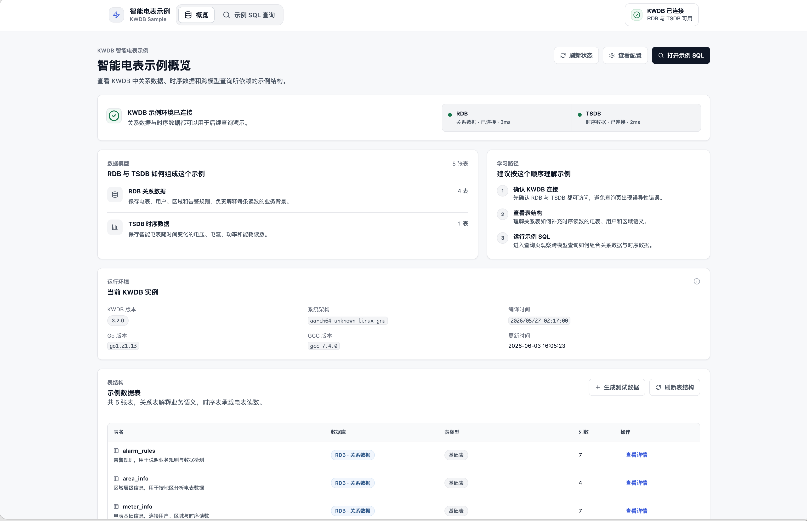
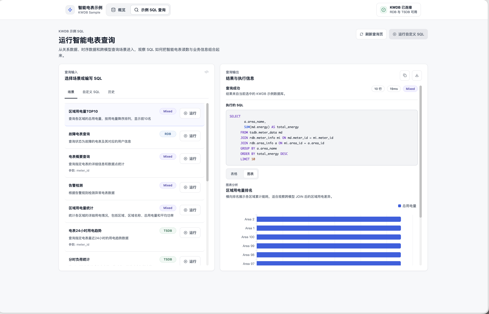

# Smart Meter Web 智能电表管理系统

一个基于 KWDB 多模数据库的智能电表数据管理和可视化演示系统。

## 🖥️ 系统截图

### 首页



### SQL 查询



## 📦 快速开始

### 方式一：Docker 容器部署（推荐）

```bash
# 运行容器
docker run -d --name smart-meter \
  -p 3001:3001 \
  kwdb/smart-meter:latest

# 访问应用
# 统一访问地址: http://localhost:3001
```

### 方式二：本地开发部署

#### 前置要求
- Node.js 18+
- KWDB 数据库
- npm 或 yarn

#### 安装步骤

1. **克隆项目**
```bash
git clone <repository-url>
cd smart-meter-web
```

2. **安装依赖**
```bash
# 安装服务器依赖
cd server
npm install

# 安装客户端依赖
cd ../client
npm install
```

3. **配置环境变量**
```bash
# 复制环境变量模板
cp server/.env.example server/.env

# 编辑配置文件
vim server/.env
```

环境变量说明：
```env
# 数据库配置
KWDB_HOST=localhost
KWDB_PORT=26257
KWDB_USER=root
KWDB_PASSWORD=
KWDB_SSL=false

# 服务器配置
PORT=3001
NODE_ENV=development
# 生产环境下前后端合并，开发环境可分离部署
CLIENT_URL=http://localhost:5173
```

4. **启动服务**

**开发模式（前后端分离）：**
```bash
# 启动后端服务
cd server
npm start

# 启动前端服务（新终端）
cd client
npm run dev

# 访问地址
# Web 界面: http://localhost:5173
# API 服务: http://localhost:3001
```

**生产模式（前后端合并）：**
```bash
# 构建前端并启动合并服务
npm run build:production
npm run start:production

# 访问地址
# 统一访问: http://localhost:3001
```

## 🐳 Docker 构建

### 单架构构建
```bash
# 在项目根目录执行
docker build -f smart-meter-web/Dockerfile -t smart-meter-web .
```

### 多架构构建
```bash
# 使用多架构构建脚本
cd smart-meter-web
./build-multiarch.sh [version]

# 示例
./build-multiarch.sh v1.0.0
```

### 日志查看
```bash
# 查看容器日志
docker logs smart-meter

# 实时查看日志
docker logs -f smart-meter

# 查看最近 100 行日志
docker logs --tail 100 smart-meter
```

## 🔒 安全说明

⚠️ **重要提醒**: 这是一个演示项目，展示了 KWDB 多模数据库在智能电表场景中的应用。在生产环境中使用时，请确保遵循安全最佳实践。
