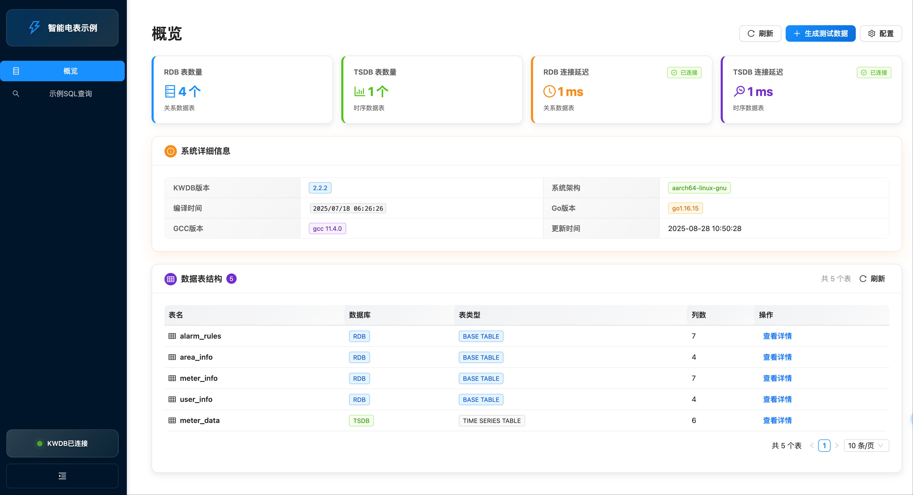
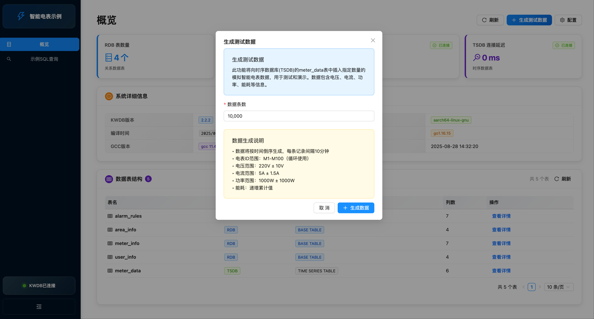
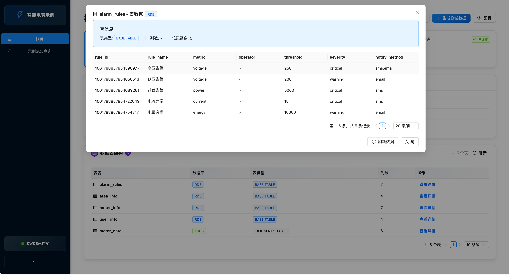
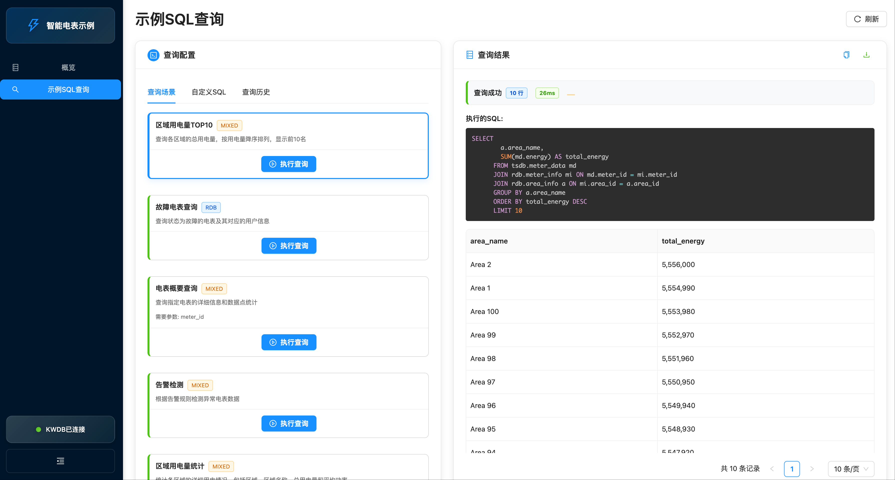
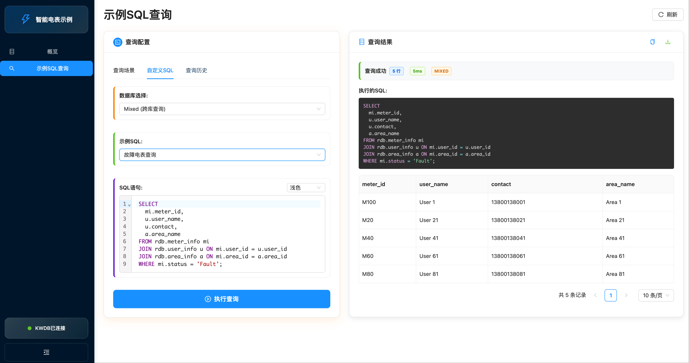
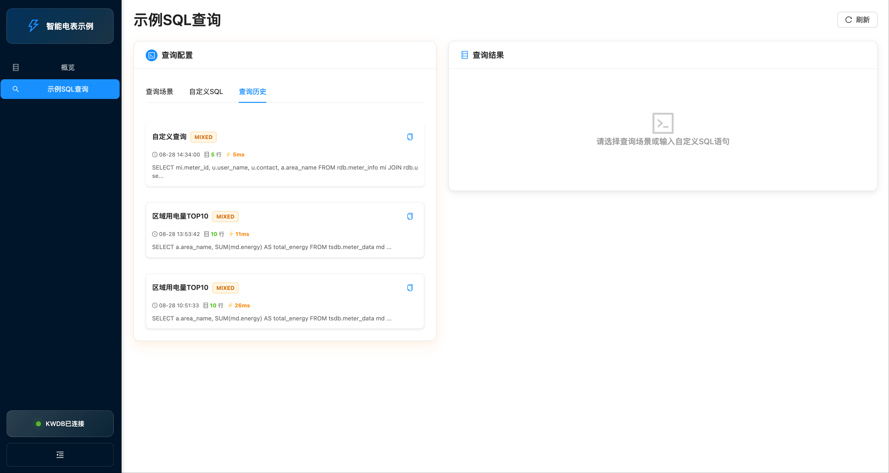

# 解锁物联网数据价值：基于 Smart Meter Web，深入实践 KWDB 跨模查询

## 一、引言：当物联网遇上多模数据挑战

在工业物联网（IIoT）时代，数据是驱动业务创新的核心燃料。以智能电网为例，海量电表每时每刻都在产生两类性质迥异的数据：一是描述设备档案、用户信息的**关系型数据**，二是记录实时电压、电流的**时序型数据**。

在传统技术栈中，开发者常被迫采用“关系型数据库 + 时序数据库”的异构组合。这种“胶水式”架构不仅显著增加了开发与运维的复杂度，更在需要跨模型关联分析时，暴露出严重的性能瓶颈与效率短板。

**如何破解这一困局？**

开源跨模数据库 **KWDB** 提供了全新的解题思路。通过原生的多模存储引擎和统一的 SQL 查询接口，让开发者能够在一个数据库中同时高效处理关系、时序等多种数据模型。

## 二、项目背景：从数据模拟到一站式体验

Smart Meter Web 是 `KWDB SampleDB` 仓库中，基于 `Smart Meter` 示例拓展的可视化项目，其设计初衷是为开发者提供一个零门槛、开箱即用的 KWDB 实战演练平台。

- **`Smart Meter` 项目**：它模拟了 KWDB 在智能电表场景下的典型应用，包含了完整的数据表结构（关系型与时序型）和海量模拟数据。
- **`Smart Meter Web` 项目**：在此基础上，我们构建了可视化的 Web 应用，并集成了 KWDB 数据库，最终通过 Docker 技术，将前端、后端、数据库及模拟数据打包成一个**一键启动、零配置**的整合式应用。用户只需一条命令，即可在本地拥有一个功能完备的智能电表示例系统，从而直观地感受跨模查询的强大魅力。

## 三、核心功能展示：直观的感受跨模查询

### 首页：系统信息及表结构



**概览**：项目首页提供了全面的系统信息和表结构展示：
- **数据概览**：通过信息卡片，直观呈现关系型数据库（RDB）和时序数据库（TSDB）的表数量及实时连接状态。
- **系统信息**：展示 KWDB 数据库的核心技术参数，包括版本信息、编译时间戳以及运行环境架构等关键指标。



**数据生成**：项目提供了数据生成功能，允许用户在时序库中生成指定数量的模拟智能电表数据。这些数据不仅包含了电压、电流等基础电力参数，还涵盖功率、能耗等衍生指标，为测试和演示提供了真实可靠的数据基础。



**数据浏览**：项目提供了清晰直观的数据表浏览界面，让用户能够轻松查阅所有数据表的详细内容。无论是关系型表中的设备基础信息，还是时序型表中的实时监测数据，都可以一目了然地进行浏览和检索。

### 示例SQL查询：展示多模关联查询



**查询示例**：示例 SQL 查询页面内置了丰富的查询场景示例，涵盖了 `Smart Meter` 项目中的所有查询场景。每个示例都以卡片形式呈现，并清晰标记了查询类型：`MIXED`（跨模查询）、`RDB`（关系型查询）和 `TSDB`（时序查询）。用户只需点击卡片上的"执行查询"按钮，即可实时查看对应的 SQL 执行结果。



**自定义查询**：在"自定义SQL"标签页中，您可以灵活选择查询类型（包括跨模查询、关系表查询和时序表查询），系统不仅提供了对应类型的示例 SQL 供您参考，您还可以直接输入自定义的 SQL 语句来执行查询并实时查看结果。



**查询历史**：项目也提供了查询历史记录功能，您可以轻松查看、重复执行之前的查询语句，并对历史查询结果进行深入分析，大大提升了数据探索的效率。

## 四、快速体验：一键部署，零配置

为了让开发者能够低成本、高效率地体验上述所有功能，我们提供了基于 Docker 的一体化部署方案。

#### 1. 快速开始

**第一步：拉取镜像**

```bash
docker pull kwdb/smart-meter:latest
```

**第二步：运行容器**

```bash
docker run -d --name smart-meter -p 3001:3001 kwdb/smart-meter:latest
```

**第三步：访问应用**

在浏览器中打开 `http://localhost:3001`，即可开始探索。

> **零配置说明**：该镜像是一个“自包含”系统，内部已集成 `Smart Meter Web` 前后端服务、KWDB 数据库以及全量模拟数据。运行时**无需任何外部依赖或环境变量配置**，真正做到了开箱即用。

#### 2. 容器运维指南

为方便您进行容器运维和问题排查，以下是常用的 Docker 命令参考：

- **实时日志监控**：`docker logs -f smart-meter`
  > 实时查看容器运行日志，掌握系统运行状态
- **容器环境访问**：`docker exec -it smart-meter /bin/bash`
  > 进入容器内部环境，便于深入排查和配置
- **容器生命周期管理**：`docker stop smart-meter && docker rm smart-meter`
  > 优雅停止并清理容器资源

## 五、总结与展望

Smart Meter Web 项目不仅是一个功能完备的智能电表示例，更是 **KWDB 跨模数据查询功能的展示**。通过这个项目，我们清晰地看到：

- **架构得以简化**：用一个 KWDB 实例替代“关系型+时序”双库，显著降低了系统复杂度和运维成本。
- **开发效率提升**：统一的 SQL 入口和强大的跨模查询能力，让开发者能更专注于业务逻辑，而非数据整合的泥潭。
- **查询性能优越**：原生的跨模引擎为复杂的关联分析提供了高性能保障。

展望未来，随着物联网场景下多模态数据的爆发式增长，像 KWDB 这样的跨模数据库将成为越来越多开发者的首选。

我们诚挚地邀请您亲自下载并运行 Smart Meter Web 项目，体验下一代数据处理的全新范式。欢迎访问项目的 [Gitee 仓库](https://gitee.com/kwdb/sampledb)，探索更多技术细节，并与我们交流反馈！
